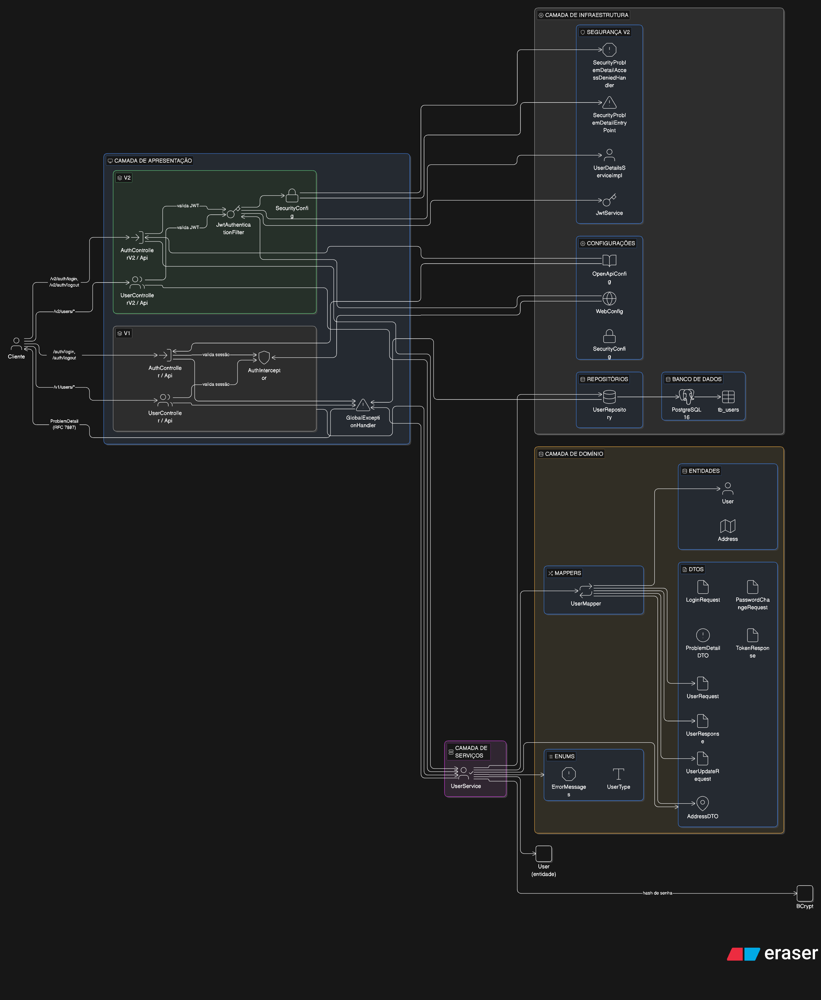
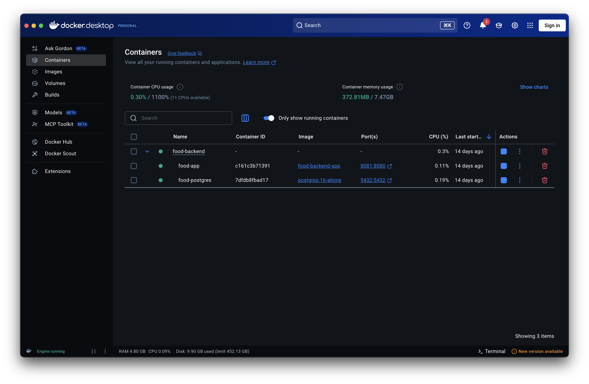
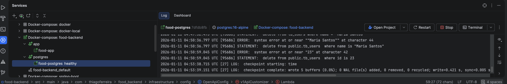
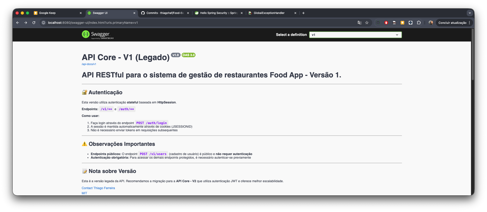

# Relatório Técnico - Sistema de Gestão de Restaurantes

**Projeto:** Food Backend - Sistema de Gestão de Restaurantes

**Equipe:**  
- Thiago Henrique Alves Ferreira - RM369442

---

## 1. Introdução

### Descrição do Problema

O sistema de gestão de restaurantes foi desenvolvido para atender às necessidades de um ambiente onde diferentes tipos de usuários (proprietários de restaurantes e clientes) necessitam realizar operações de gerenciamento através de uma API REST robusta e segura. O desafio principal envolve a criação de um backend que forneça funcionalidades completas de CRUD para usuários, implementando mecanismos de autenticação e autorização, garantindo a segurança dos dados e oferecendo uma experiência consistente através de documentação automática e tratamento padronizado de erros.

O sistema precisa suportar operações como cadastro de usuários, autenticação, busca por diferentes critérios (nome, email, login, ID), atualização de informações cadastrais, alteração de senha e exclusão de usuários, sempre respeitando regras de negócio como unicidade de email e login, validação de credenciais e segurança na manipulação de senhas.

### Objetivo do Projeto

Desenvolver um backend robusto utilizando Spring Boot para gerenciar usuários e atender aos requisitos definidos. O projeto visa implementar uma API REST completa com duas versões de autenticação coexistentes (V1 com sessão HTTP e V2 com JWT), tratamento padronizado de erros conforme RFC 7807 (ProblemDetail), validações em múltiplas camadas, documentação automática via Swagger/OpenAPI, e containerização através de Docker para facilitar a execução e deployment.

## 2. Arquitetura do Sistema

### Descrição da Arquitetura

A arquitetura adotada segue um padrão em camadas (Layered Architecture) com separação clara de responsabilidades. O sistema está organizado em camadas distintas:

**Camada de Apresentação (Controllers):**
- Controllers REST separados por versão (V1 e V2), cada um implementando seus respectivos endpoints e tipos de autenticação
- Utiliza padrão de interfaces (`*ControllerApi`, `*ControllerV2Api`) que definem o contrato da API e contêm todas as anotações Spring Web, Validação e Documentação
- Os controllers focam exclusivamente em receber requisições HTTP, delegar processamento aos services e formatar respostas

**Camada de Domínio (Entities e DTOs):**
- Entidades JPA (`User`, `Address`) que representam o modelo de dados persistido
- DTOs (`UserRequest`, `UserResponse`, `UserUpdateRequest`, `PasswordChangeRequest`) que protegem as entidades de domínio de exposição direta na API
- Transformação entre DTOs e entidades realizada pelo `UserMapper`, centralizando a lógica de conversão

**Camada de Serviços:**
- `UserService` isolado dos controllers, contendo toda a lógica de negócio
- Validações de domínio (unicidade de email/login, validação de senha)
- Regras de negócio críticas como alteração de senha e autenticação

**Camada de Infraestrutura:**
- Repositórios JPA (`UserRepository`) para acesso a dados
- Configurações (`OpenApiConfig`, `WebConfig`, `SecurityConfig`)
- Interceptadores (`AuthInterceptor` para V1) e filtros (`JwtAuthenticationFilter` para V2)
- Tratamento de exceções através do `GlobalExceptionHandler`, que converte todas as exceções em objetos `ProblemDetail` conforme o RFC 7807

**Tecnologias Utilizadas:**
- **Spring Boot 4.0.1**: Framework principal com autoconfiguração e gestão de dependências
- **Java 21**: Linguagem de programação LTS com recursos modernos
- **PostgreSQL 16**: Banco de dados relacional com suporte ACID
- **Spring Data JPA/Hibernate**: ORM para persistência de dados
- **Spring Security**: Framework de segurança para autenticação JWT (V2)
- **jBCrypt**: Biblioteca para hashing seguro de senhas
- **JWT (jjwt v0.12.5)**: Autenticação stateless na V2
- **SpringDoc OpenAPI 3**: Documentação automática da API via Swagger UI
- **Bean Validation**: Validações de entrada nos DTOs
- **Docker e Docker Compose**: Containerização da aplicação e banco de dados
- **JaCoCo**: Análise de cobertura de código (meta mínima de 80%)
- **JUnit 5**: Framework de testes automatizados

A aplicação suporta duas versões de autenticação coexistentes. A versão 1 (V1) utiliza autenticação stateful baseada em `HttpSession`, implementada manualmente através do `AuthInterceptor`. A versão 2 (V2) migra para autenticação stateless usando JWT (JSON Web Tokens) gerenciada pelo Spring Security através da classe `SecurityConfig` e do filtro `JwtAuthenticationFilter`. Essa coexistência permite migração gradual sem impactar clientes existentes.

### Estrutura do Projeto

```
food-backend/
├── src/
│   ├── main/
│   │   ├── java/com/thiagoferreira/food_backend/
│   │   │   ├── Application.java                    # Classe principal da aplicação
│   │   │   ├── controllers/                        # Controladores REST
│   │   │   │   ├── AuthController.java             # Implementação autenticação V1 (HttpSession)
│   │   │   │   ├── AuthControllerApi.java          # Interface autenticação V1
│   │   │   │   ├── AuthControllerV2.java           # Implementação autenticação V2 (JWT)
│   │   │   │   ├── AuthControllerV2Api.java        # Interface autenticação V2
│   │   │   │   ├── UserController.java             # Implementação usuários V1
│   │   │   │   ├── UserControllerApi.java          # Interface usuários V1
│   │   │   │   ├── UserControllerV2.java           # Implementação usuários V2
│   │   │   │   └── UserControllerV2Api.java        # Interface usuários V2
│   │   │   ├── interceptors/                       # Interceptadores HTTP
│   │   │   │   └── AuthInterceptor.java            # Interceptor de autenticação V1
│   │   │   ├── domain/
│   │   │   │   ├── dto/                            # Data Transfer Objects
│   │   │   │   ├── entities/                       # Entidades JPA
│   │   │   │   └── enums/                          # Enumeradores
│   │   │   ├── exceptions/                         # Tratamento de exceções
│   │   │   ├── infraestructure/
│   │   │   │   ├── config/                         # Configurações
│   │   │   │   ├── repositories/                   # Repositórios JPA
│   │   │   │   └── security/                       # Configurações de segurança V2
│   │   │   ├── mappers/                            # Mappers DTO/Entity
│   │   │   └── services/                           # Lógica de negócio
│   │   └── resources/
│   │       └── application.properties               # Configurações da aplicação
│   └── test/                                       # Testes automatizados
├── docker-compose.yml                              # Configuração Docker Compose
├── Dockerfile                                      # Imagem Docker
└── pom.xml                                         # Configuração Maven
```

### Diagrama da Arquitetura

A arquitetura em camadas pode ser visualizada através da seguinte estrutura:

```
┌─────────────────────────────────────────────────────────┐
│              Camada de Apresentação                     │
│  Controllers (V1/V2) → Interfaces API → Documentação    │
└───────────────────┬─────────────────────────────────────┘
                    │
┌───────────────────▼─────────────────────────────────────┐
│              Camada de Domínio                          │
│     DTOs ↔ UserMapper ↔ Entities (JPA)                  │
└───────────────────┬─────────────────────────────────────┘
                    │
┌───────────────────▼─────────────────────────────────────┐
│            Camada de Serviços                           │
│         UserService (Lógica de Negócio)                 │
└───────────────────┬─────────────────────────────────────┘
                    │
┌───────────────────▼─────────────────────────────────────┐
│          Camada de Infraestrutura                       │
│  Repositories → JPA/Hibernate → PostgreSQL              │
│  Security (JWT Filter / Session Interceptor)            │
│  Exception Handler (ProblemDetail)                      │
└─────────────────────────────────────────────────────────┘
```

#### Diagrama Visual da Arquitetura

O diagrama visual abaixo ilustra a arquitetura completa do sistema, incluindo as camadas, componentes principais e fluxo de dados. Este diagrama foi gerado utilizando o DiagramGPT da Eraser.



*Nota: Diagrama gerado utilizando o DiagramGPT da Eraser (https://eraser.io)*

#### Estrutura do Banco de Dados PostgreSQL


## 3. Descrição dos Endpoints da API

### Tabela de Endpoints

#### Autenticação V1 (`/auth`)

| Endpoint | Método | Descrição |
| --- | --- | --- |
| `/auth/login` | POST | Autenticar usuário e criar sessão HTTP (público) |
| `/auth/logout` | POST | Encerrar sessão do usuário (requer autenticação) |

#### Usuários V1 (`/v1/users`)

| Endpoint | Método | Descrição |
| --- | --- | --- |
| `/v1/users` | POST | Criar novo usuário (público) |
| `/v1/users` | GET | Listar todos os usuários (requer autenticação) |
| `/v1/users/{id}` | GET | Buscar usuário por ID (requer autenticação) |
| `/v1/users/search/name?name={nome}` | GET | Buscar usuários por nome - parâmetro opcional, se não fornecido retorna todos (requer autenticação) |
| `/v1/users/search/login?login={login}` | GET | Buscar usuário por login (requer autenticação) |
| `/v1/users/search/email?email={email}` | GET | Buscar usuário por email (requer autenticação) |
| `/v1/users/{id}` | PUT | Atualizar informações do usuário - nome e endereço (requer autenticação) |
| `/v1/users/{id}/password` | PATCH | Alterar senha do usuário (requer autenticação) |
| `/v1/users/{id}` | DELETE | Deletar usuário (requer autenticação) |

#### Autenticação V2 (`/v2/auth`)

| Endpoint | Método | Descrição |
| --- | --- | --- |
| `/v2/auth/login` | POST | Autenticar usuário e obter token JWT (público) |
| `/v2/auth/logout` | POST | Logout do usuário - descartar token (requer JWT) |

#### Usuários V2 (`/v2/users`)

| Endpoint | Método | Descrição |
| --- | --- | --- |
| `/v2/users` | POST | Criar novo usuário (público) |
| `/v2/users` | GET | Listar todos os usuários (requer JWT) |
| `/v2/users/{id}` | GET | Buscar usuário por ID (requer JWT) |
| `/v2/users/search/name?name={nome}` | GET | Buscar usuários por nome - parâmetro opcional, se não fornecido retorna todos (requer JWT) |
| `/v2/users/search/login?login={login}` | GET | Buscar usuário por login (requer JWT) |
| `/v2/users/search/email?email={email}` | GET | Buscar usuário por email (requer JWT) |
| `/v2/users/{id}` | PUT | Atualizar informações do usuário - nome e endereço (requer JWT) |
| `/v2/users/{id}/password` | PATCH | Alterar senha do usuário (requer JWT) |
| `/v2/users/{id}` | DELETE | Deletar usuário (requer JWT) |

### Exemplos de Requisição e Resposta

#### Criar Usuário (POST `/v1/users` ou `/v2/users`)

**Requisição:**
```json
POST /v1/users
Content-Type: application/json

{
  "name": "João Silva",
  "email": "joao@example.com",
  "login": "joao123",
  "password": "senha123",
  "type": "CUSTOMER",
  "address": {
    "street": "Rua das Flores",
    "number": "123",
    "city": "São Paulo",
    "zipCode": "01234-567"
  }
}
```

**Resposta (201 Created):**
```json
{
  "id": 1,
  "name": "João Silva",
  "email": "joao@example.com",
  "login": "joao123",
  "type": "CUSTOMER",
  "address": {
    "street": "Rua das Flores",
    "number": "123",
    "city": "São Paulo",
    "zipCode": "01234-567"
  },
  "createdAt": "2024-01-15T10:30:00",
  "lastUpdated": "2024-01-15T10:30:00"
}
```

#### Login V1 (POST `/auth/login`)

**Requisição:**
```json
POST /auth/login
Content-Type: application/json

{
  "login": "joao123",
  "password": "senha123"
}
```

**Resposta (200 OK):**  
Sessão HTTP criada. O cliente deve manter o cookie `JSESSIONID` para acessar endpoints protegidos.

#### Login V2 (POST `/v2/auth/login`)

**Requisição:**
```json
POST /v2/auth/login
Content-Type: application/json

{
  "login": "joao123",
  "password": "senha123"
}
```

**Resposta (200 OK):**
```json
{
  "token": "eyJhbGciOiJIUzI1NiIsInR5cCI6IkpXVCJ9...",
  "type": "Bearer"
}
```

**Uso do Token:**  
Incluir o token no header `Authorization: Bearer {token}` para acessar endpoints protegidos V2.

#### Buscar Usuário por ID (GET `/v1/users/{id}` ou `/v2/users/{id}`)

**Requisição:**
```
GET /v1/users/1
```

**Resposta (200 OK):**
```json
{
  "id": 1,
  "name": "João Silva",
  "email": "joao@example.com",
  "login": "joao123",
  "type": "CUSTOMER",
  "address": {
    "street": "Rua das Flores",
    "number": "123",
    "city": "São Paulo",
    "zipCode": "01234-567"
  },
  "createdAt": "2024-01-15T10:30:00",
  "lastUpdated": "2024-01-15T10:30:00"
}
```

#### Atualizar Usuário (PUT `/v1/users/{id}` ou `/v2/users/{id}`)

**Requisição:**
```json
PUT /v1/users/1
Content-Type: application/json

{
  "name": "João Silva Santos",
  "address": {
    "street": "Avenida Paulista",
    "number": "1000",
    "city": "São Paulo",
    "zipCode": "01310-100"
  }
}
```

**Resposta (200 OK):**
```json
{
  "id": 1,
  "name": "João Silva Santos",
  "email": "joao@example.com",
  "login": "joao123",
  "type": "CUSTOMER",
  "address": {
    "street": "Avenida Paulista",
    "number": "1000",
    "city": "São Paulo",
    "zipCode": "01310-100"
  },
  "createdAt": "2024-01-15T10:30:00",
  "lastUpdated": "2024-01-15T14:20:00"
}
```

#### Alterar Senha (PATCH `/v1/users/{id}/password` ou `/v2/users/{id}/password`)

**Requisição:**
```json
PATCH /v1/users/1/password
Content-Type: application/json

{
  "currentPassword": "senha123",
  "newPassword": "novaSenha456"
}
```

**Resposta (204 No Content):**  
Senha alterada com sucesso.

#### Resposta de Erro (ProblemDetail - RFC 7807)

**Exemplo - Usuário não encontrado (404):**
```json
{
  "type": "https://api.food-backend.com/problems/resource-not-found",
  "title": "Recurso não encontrado",
  "status": 404,
  "detail": "Usuário com ID 999 não encontrado",
  "timestamp": "2024-01-15T14:30:00",
  "path": "/v1/users/999"
}
```

**Exemplo - Validação de entrada (400):**
```json
{
  "type": "https://api.food-backend.com/problems/validation-error",
  "title": "Erro de validação",
  "status": 400,
  "detail": "Erros de validação encontrados",
  "timestamp": "2024-01-15T14:30:00",
  "path": "/v1/users",
  "errors": [
    {
      "field": "email",
      "message": "Email inválido"
    },
    {
      "field": "password",
      "message": "A senha deve ter no mínimo 6 caracteres"
    }
  ]
}
```

## 4. Configuração do Projeto

### Configuração do Docker Compose

O arquivo `docker-compose.yml` orquestra dois serviços principais: o banco de dados PostgreSQL e a aplicação Spring Boot.

**Serviço PostgreSQL (`postgres`):**
- Imagem: `postgres:16-alpine`
- Container: `food-postgres`
- Porta: `5432:5432`
- Variáveis de ambiente:
  - `POSTGRES_DB=food_db`
  - `POSTGRES_USER=postgres`
  - `POSTGRES_PASSWORD=postgres`
- Volume persistente: `postgres_data` montado em `/var/lib/postgresql/data`
- Health check: `pg_isready -U postgres` verifica disponibilidade a cada 10 segundos

**Serviço Aplicação (`app`):**
- Build: Utiliza o `Dockerfile` local para construir a imagem
- Container: `food-app`
- Dependência: Aguarda o serviço `postgres` estar saudável (`condition: service_healthy`)
- Variáveis de ambiente:
  - `DB_HOST=postgres`
  - `DB_PORT=5432`
  - `DB_NAME=food_db`
  - `DB_USER=postgres`
  - `DB_PASSWORD=postgres`
  - `SERVER_PORT=8080`
- Porta: `8081:8080` (mapeia porta 8081 do host para 8080 do container)

O `Dockerfile` utiliza multi-stage build para otimizar o tamanho da imagem final: primeiro stage compila a aplicação com Maven, segundo stage executa apenas o JAR gerado usando JRE.





### Instruções para Execução Local

**Pré-requisitos:**
- Docker e Docker Compose instalados
- Maven 3.9+ (opcional, para execução local sem Docker)
- Java 21 (opcional, para execução local sem Docker)
- PostgreSQL 16 (opcional, para execução local sem Docker)

**Opção 1: Execução com Docker Compose (Recomendado)**

1. Navegue até o diretório do projeto:
```bash
cd food-backend
```

2. Construa e inicie todos os serviços:
```bash
docker-compose up --build
```

3. Para executar em background (detached mode):
```bash
docker-compose up -d --build
```

4. Acesse a aplicação:
   - **API Base:** http://localhost:8081
   - **Swagger UI:** http://localhost:8081/swagger-ui.html
   - **OpenAPI JSON:** http://localhost:8081/api-docs

5. Para parar os serviços:
```bash
docker-compose down
```

**Opção 2: Execução Local com Maven**

1. Configure o banco de dados PostgreSQL:
   - Crie um banco de dados chamado `food_db`
   - Configure as credenciais em `application.properties` ou variáveis de ambiente

2. Execute a aplicação:
```bash
cd food-backend
./mvnw spring-boot:run
```

3. Acesse a aplicação:
   - **API Base:** http://localhost:8080
   - **Swagger UI:** http://localhost:8080/swagger-ui.html
   - **OpenAPI JSON:** http://localhost:8080/api-docs

**Variáveis de Ambiente (opcional):**

Se executando localmente, você pode configurar as seguintes variáveis de ambiente:

- `DB_HOST` - Host do banco de dados (padrão: `localhost`)
- `DB_PORT` - Porta do banco de dados (padrão: `5432`)
- `DB_NAME` - Nome do banco de dados (padrão: `food_db`)
- `DB_USER` - Usuário do banco de dados (padrão: `postgres`)
- `DB_PASSWORD` - Senha do banco de dados (padrão: `postgres`)
- `SERVER_PORT` - Porta da aplicação (padrão: `8080`)

## 5. Qualidade do Código

### Boas Práticas Utilizadas

**1. Separação de Responsabilidades (SRP - Single Responsibility Principle):**
- Controllers focam apenas em receber requisições HTTP e formatar respostas
- Services contêm toda a lógica de negócio isolada
- Repositories gerenciam apenas acesso a dados
- Mappers centralizam transformações entre DTOs e entidades

**2. Arquitetura em Camadas:**
- Separação clara entre camadas de apresentação, domínio, serviços e infraestrutura
- Baixo acoplamento entre camadas através de interfaces
- Alta coesão dentro de cada camada

**3. Padrão de Interfaces dos Controllers:**
- Interfaces (`*ControllerApi`) definem o contrato da API com todas as anotações (Spring Web, Validação, Documentação)
- Classes de implementação mantêm apenas a lógica de negócio
- Facilita testabilidade, manutenibilidade e documentação centralizada

**4. DRY (Don't Repeat Yourself):**
- Lógica de transformação centralizada no `UserMapper`
- Tratamento de exceções centralizado no `GlobalExceptionHandler`
- Validações reutilizáveis através de Bean Validation
- Código de negócio compartilhado entre V1 e V2 (apenas camada de apresentação duplicada)

**5. SOLID Principles:**
- **Single Responsibility**: Cada classe tem uma responsabilidade única e bem definida
- **Open/Closed**: Extensível através de interfaces e herança, fechado para modificação
- **Liskov Substitution**: Interfaces implementadas corretamente por classes concretas
- **Interface Segregation**: Interfaces específicas para cada controller
- **Dependency Inversion**: Controllers dependem de abstrações (interfaces) ao invés de implementações concretas

**6. Tratamento Padronizado de Erros:**
- Todas as exceções convertidas para `ProblemDetail` (RFC 7807)
- Formato consistente de respostas de erro em toda a API
- Informações detalhadas de validação quando aplicável

**7. Segurança:**
- Senhas hashadas com BCrypt (salt automático)
- Separação explícita entre atualização de dados cadastrais e alteração de senha
- Validação de senha atual antes de permitir alteração
- Autenticação através de sessão HTTP (V1) ou JWT (V2)
- Proteção de endpoints através de interceptadores e filtros

**8. Validações em Múltiplas Camadas:**
- **Validações de Entrada (Bean Validation)**: Nos DTOs, garantindo formato e estrutura
- **Validações de Domínio**: No service, garantindo regras de negócio (unicidade, existência, etc.)

**9. Documentação Automática:**
- Swagger/OpenAPI 3.0 com documentação interativa
- Anotações detalhadas em cada endpoint
- Exemplos de requisição e resposta
- Separação de versões (V1 e V2) no Swagger

**10. Testes e Cobertura:**
- Suíte completa de testes automatizados (unitários e de integração)
- JaCoCo configurado com meta mínima de 80% de cobertura de linhas
- Testes de controllers, services, mappers, interceptors, handlers e configurações
- Build falha se cobertura ficar abaixo do mínimo

**11. Convenções do Spring Boot:**
- Uso de `@RequiredArgsConstructor` (Lombok) para injeção de dependências
- Configuração automática através de `application.properties`
- JPA Auditing para campos de auditoria (`createdAt`, `lastUpdated`)
- Uso adequado de `@Transactional` onde necessário

**12. Versionamento de API:**
- Coexistência de duas versões (V1 e V2) sem impacto em clientes existentes
- Migração gradual permitida
- Código de negócio compartilhado entre versões

#### Relatório de Cobertura JaCoCo


## 6. Collections para Teste

### Link para a Collection do Postman

A coleção completa do Postman está disponível no arquivo `Food_Backend.json` na raiz do projeto. Esta coleção contém todos os cenários de teste organizados em pastas.

**Como importar:**
1. Abra o Postman
2. Clique em "Import" (canto superior esquerdo)
3. Selecione o arquivo `Food_Backend.json`
4. Configure a variável de ambiente `base_url`:
   - Execução local (Maven): `http://localhost:8080`
   - Execução Docker: `http://localhost:8081`

### Descrição dos Testes Manuais

A coleção do Postman está organizada nas seguintes categorias:

**0. Autenticação:**
- Login com sucesso
- Login com senha incorreta
- Login com usuário não encontrado
- Validações de login e senha vazios
- Logout
- Acesso não autorizado (sem login e após logout)

**1. ResourceNotFoundException (404):**
- Buscar usuário por ID/email/login inexistente
- Atualizar/deletar/alterar senha de usuário inexistente

**2. DomainValidationException (400):**
- Criar usuário com email duplicado
- Alterar senha com senha atual igual a nova senha

**3. MethodArgumentNotValidException (400):**
- Criar/atualizar usuário com campos vazios ou inválidos
- Alterar senha com validações de entrada

**4. Novos Tratamentos de Erro:**
- Endpoints inexistentes (404)
- IDs com tipo inválido (400)
- Parâmetros faltando (400)
- Content-Type não suportado (415)
- JSON malformado (400)
- Método HTTP não suportado (405)

**5. Casos de Sucesso:**
- Criar usuário válido
- Listar todos os usuários
- Buscar usuário por ID/nome/email/login
- Atualizar usuário
- Alterar senha
- Deletar usuário

**6. Endpoints V2 - JWT Authentication:**
- Autenticação V2 (login/logout com JWT)
- Casos de sucesso V2 (todos os endpoints protegidos)
- Erros V2 (validações e exceções retornando ProblemDetail)

**Documentação Swagger:**

A documentação interativa está disponível em:
- **V1:** http://localhost:8080/swagger-ui.html (grupo "v1")
- **V2:** http://localhost:8080/swagger-ui.html (grupo "v2")




**Fluxo de Teste Recomendado:**

1. Importe a coleção do Postman
2. Execute "POST - Criar usuário válido (público)" para criar um usuário
3. Execute "POST - Login (sucesso)" para autenticar e criar sessão
4. Teste os endpoints protegidos (GET, PUT, PATCH, DELETE)
5. Execute "POST - Logout" para encerrar sessão
6. Verifique que tentativas de acesso após logout retornam 401
7. Para V2, execute login e use o token JWT retornado no header `Authorization: Bearer {token}`

## 7. Repositório do Código

### URL do Repositório

**GitHub:** [https://github.com/thiagohaf/Food-Backend](https://github.com/thiagohaf/Food-Backend)

O repositório contém:
- Código-fonte completo do projeto
- Arquivo `Food_Backend.json` com a coleção do Postman
- Documentação adicional (README.md, POSTMAN_TEST_GUIDE.md)
- Configurações Docker (docker-compose.yml, Dockerfile)
- Testes automatizados com cobertura JaCoCo

---

## Considerações Finais

Este relatório técnico documenta o desenvolvimento do sistema de gestão de restaurantes, demonstrando a aplicação de conceitos importantes como separação de responsabilidades, tratamento padronizado de erros (RFC 7807), documentação automática de APIs, validações em múltiplas camadas, segurança com hashing de senhas (BCrypt) e containerização através de Docker.

A escolha de tecnologias modernas como Spring Boot 4.0.1, Java 21, PostgreSQL e Docker garante que a aplicação esteja preparada para escalabilidade e manutenção futura. A coexistência de duas versões da API (V1 com sessão HTTP e V2 com JWT) permite migração gradual sem impactar clientes existentes, enquanto o sistema abrangente de validações implementado garante a integridade dos dados em todas as camadas da aplicação.

O projeto alcança mais de 80% de cobertura de código através de testes automatizados, seguindo boas práticas de desenvolvimento como SOLID, DRY e arquitetura em camadas, resultando em um código limpo, testável e manutenível.