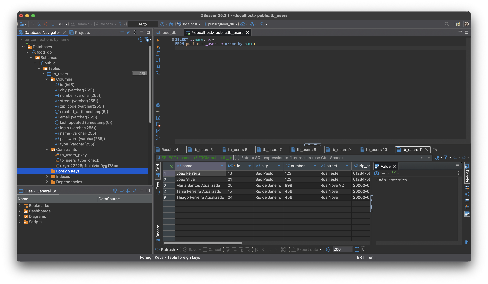
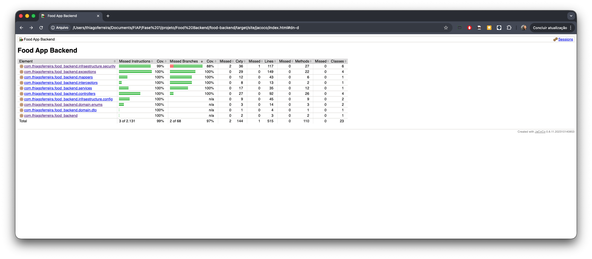

# Relatório Técnico - Sistema de Gestão de Restaurantes

**Autor:** Thiago Henrique Alves Ferreira  
**Instituição:** FIAP - Faculdade de Informática e Administração Paulista  
**Curso:** Arquitetura e Desenvolvimento Java  
**Contato:** rm369442@fiap.com.br

**Repositório:** [https://github.com/thiagohaf/Food-Backend](https://github.com/thiagohaf/Food-Backend)

---

## 1. Visão Geral e Arquitetura

### Tecnologias Utilizadas

O projeto foi desenvolvido utilizando um conjunto moderno de tecnologias Java que garantem robustez, segurança e facilidade de manutenção. A seleção das tecnologias priorizou frameworks maduros e amplamente adotados no ecossistema Spring, permitindo aproveitar toda a comunidade e documentação disponível.

**Framework e Core:**
- **Spring Boot 4.0.1**: Framework principal escolhido por sua capacidade de reduzir significativamente a configuração inicial através de convenções sensatas e autoconfiguração. O Spring Boot facilita muito o desenvolvimento através da automação de configuração e gestão de dependências, o que reduz significativamente o tempo de desenvolvimento e minimiza erros de configuração.
- **Java 21**: Linguagem de programação utilizada, escolhida por ser uma versão LTS (Long Term Support) que oferece recursos modernos como Records, Pattern Matching e melhorias de performance.
- **Maven**: Gerenciador de dependências e ferramenta de build utilizada. O projeto inclui Maven Wrapper (`mvnw`) para garantir consistência entre diferentes ambientes de desenvolvimento.

**Persistência de Dados:**
- **Spring Data JPA**: Camada de persistência que abstrai o acesso a dados através de interfaces Repository, reduzindo código boilerplate e simplificando operações CRUD.
- **PostgreSQL 16**: Banco de dados relacional escolhido por sua robustez, conformidade com SQL, suporte a ACID e performance. A escolha por PostgreSQL permite garantir integridade referencial e transações críticas para operações como criação de usuário e alteração de senha.
- **Hibernate**: ORM (Object-Relational Mapping) utilizado pelo Spring Data JPA, que mapeia entidades Java para tabelas do banco de dados e gerencia o ciclo de vida das entidades.

**Validação e Documentação:**
- **Bean Validation (JSR 303/380)**: Especificação Java para validação de dados através de anotações, integrada ao Spring Boot Starter Validation. Utilizada para validações de entrada nos DTOs.
- **SpringDoc OpenAPI 3 (v2.7.0)**: Biblioteca utilizada para gerar documentação automática da API em formato OpenAPI 3.0, disponibilizando interface Swagger UI interativa.
- **Swagger Annotations (v2.2.22)**: Anotações para enriquecer a documentação da API com descrições detalhadas, exemplos e esquemas de resposta.

**Segurança:**
- **jBCrypt (v0.4)**: Biblioteca para hashing de senhas utilizando o algoritmo BCrypt, que gera salt automático para cada senha, aumentando a segurança contra ataques de força bruta.
- **HttpSession**: Mecanismo de sessão HTTP utilizado na versão 1 (V1) para autenticação stateful baseada em sessão.
- **Spring Security**: Framework de segurança do ecossistema Spring utilizado na versão 2 (V2) para gerenciar autenticação e autorização.
- **JWT (JSON Web Tokens) - jjwt (v0.12.5)**: Biblioteca utilizada para implementar autenticação stateless através de tokens JWT na versão 2 (V2). A versão 0.12.5 foi escolhida por ser compatível com Java 21 e Spring Boot 4.0.1.

**Utilitários:**
- **Lombok**: Biblioteca que reduz código boilerplate através de anotações processadas em tempo de compilação (ex: `@RequiredArgsConstructor`, `@Getter`, `@Setter`), mantendo o código mais limpo e legível.

**Testes e Qualidade:**
- **JUnit 5**: Framework de testes padrão da plataforma Java, incluído no Spring Boot Starter Test. Utilizado para escrever testes unitários e de integração.
- **JaCoCo (v0.8.11)**: Ferramenta de análise de cobertura de código que instrumenta o código durante a execução dos testes e gera relatórios detalhados. Configurado com meta mínima de 80% de cobertura de linhas.
- **Maven Surefire Plugin**: Plugin Maven que executa testes durante o build, integrado com o JaCoCo para coletar dados de cobertura.

**Containerização:**
- **Docker**: Tecnologia de containerização utilizada para empacotar a aplicação e suas dependências em uma imagem isolada.
- **Docker Compose**: Ferramenta para orquestrar múltiplos containers (aplicação Spring Boot e PostgreSQL), facilitando a execução local e garantindo consistência entre ambientes.

A escolha dessas tecnologias modernas como Spring Boot 4.0.1, Java 21, PostgreSQL e Docker garante que a aplicação esteja preparada para escalabilidade e manutenção futura, aproveitando as melhores práticas e padrões estabelecidos na comunidade Java.

A arquitetura adotada segue um padrão em camadas (Layered Architecture) com separação clara de responsabilidades. Optei por isolar as regras de negócio na camada de serviços (`UserService`), evitando que os controllers (`UserController`, `UserControllerV2`) fiquem poluídos com lógica de domínio. Os controllers focam exclusivamente em receber requisições HTTP, delegar processamento aos services e formatar respostas.

Entre a camada de apresentação e a de domínio, implementei uma camada de DTOs (`UserRequest`, `UserResponse`, `UserUpdateRequest`, `PasswordChangeRequest`) que protege as entidades de domínio (`User`, `Address`) de exposição direta na API. A transformação entre DTOs e entidades é realizada pelo `UserMapper`, componente que centraliza essa lógica de conversão. Essa decisão de design evita acoplamento entre o contrato da API e a estrutura interna do banco de dados, facilitando futuras evoluções sem quebrar contratos já estabelecidos.

Para padronização de respostas de erro, implementei o tratamento de exceções através do `GlobalExceptionHandler`, que converte todas as exceções em objetos `ProblemDetail` conforme o RFC 7807. Isso garante que qualquer erro retornado pela API siga um formato consistente com os campos `type`, `title`, `status`, `detail` e propriedades customizadas. Exceções de domínio como `DomainValidationException` e `ResourceNotFoundException` são capturadas e transformadas em respostas HTTP apropriadas.

A aplicação suporta duas versões de autenticação coexistentes. A versão 1 (V1) utiliza autenticação stateful baseada em `HttpSession`, implementada manualmente através do `AuthInterceptor` que intercepta requisições e verifica a existência de sessão válida. A versão 2 (V2) migra para autenticação stateless usando JWT (JSON Web Tokens) gerenciada pelo Spring Security através da classe `SecurityConfig` e do filtro `JwtAuthenticationFilter`. Essa coexistência permite migração gradual sem impactar clientes existentes.

### Estrutura do Projeto

A organização do código segue uma estrutura modular que reflete a arquitetura em camadas adotada. O projeto está organizado no diretório `food-backend/` e segue o padrão Maven de estrutura de diretórios. A seguir, apresento a estrutura completa do projeto:

```
food-backend/
├── src/
│   ├── main/
│   │   ├── java/com/thiagoferreira/food_backend/
│   │   │   ├── Application.java                    # Classe principal da aplicação
│   │   │   ├── controllers/                        # Controladores REST
│   │   │   │   ├── AuthController.java             # Autenticação V1 (HttpSession)
│   │   │   │   ├── AuthControllerV2.java           # Autenticação V2 (JWT)
│   │   │   │   ├── UserController.java             # Gerenciamento de usuários V1
│   │   │   │   └── UserControllerV2.java           # Gerenciamento de usuários V2
│   │   │   ├── interceptors/                       # Interceptadores HTTP
│   │   │   │   └── AuthInterceptor.java            # Interceptor de autenticação V1
│   │   │   ├── domain/
│   │   │   │   ├── dto/                            # Data Transfer Objects
│   │   │   │   │   ├── AddressDTO.java
│   │   │   │   │   ├── LoginRequest.java
│   │   │   │   │   ├── PasswordChangeRequest.java
│   │   │   │   │   ├── ProblemDetailDTO.java
│   │   │   │   │   ├── TokenResponse.java
│   │   │   │   │   ├── UserRequest.java
│   │   │   │   │   ├── UserResponse.java
│   │   │   │   │   └── UserUpdateRequest.java
│   │   │   │   ├── entities/                       # Entidades JPA
│   │   │   │   │   ├── Address.java
│   │   │   │   │   └── User.java
│   │   │   │   └── enums/                          # Enumeradores
│   │   │   │       ├── ErrorMessages.java
│   │   │   │       └── UserType.java
│   │   │   ├── exceptions/                         # Tratamento de exceções
│   │   │   │   ├── DomainValidationException.java
│   │   │   │   ├── GlobalExceptionHandler.java
│   │   │   │   ├── ResourceNotFoundException.java
│   │   │   │   └── UnauthorizedException.java
│   │   │   ├── infraestructure/
│   │   │   │   ├── config/                         # Configurações
│   │   │   │   │   ├── OpenApiConfig.java          # Configuração do Swagger/OpenAPI
│   │   │   │   │   └── WebConfig.java              # Configuração web (interceptors)
│   │   │   │   ├── repositories/                   # Repositórios JPA
│   │   │   │   │   └── UserRepository.java
│   │   │   │   └── security/                       # Configurações de segurança V2
│   │   │   │       ├── JwtAuthenticationFilter.java
│   │   │   │       ├── JwtService.java
│   │   │   │       ├── SecurityConfig.java
│   │   │   │       ├── SecurityProblemDetailAccessDeniedHandler.java
│   │   │   │       ├── SecurityProblemDetailEntryPoint.java
│   │   │   │       └── UserDetailsServiceImpl.java
│   │   │   ├── mappers/                            # Mappers DTO/Entity
│   │   │   │   └── UserMapper.java
│   │   │   └── services/                           # Lógica de negócio
│   │   │       └── UserService.java
│   │   └── resources/
│   │       └── application.properties               # Configurações da aplicação
│   └── test/                                       # Testes automatizados
│       └── java/com/thiagoferreira/food_backend/
│           ├── controllers/
│           ├── exceptions/
│           ├── infraestructure/
│           ├── interceptors/
│           ├── mappers/
│           └── services/
├── docker-compose.yml                              # Configuração Docker Compose
├── Dockerfile                                      # Imagem Docker
├── pom.xml                                         # Configuração Maven
└── README.md                                       # Documentação do projeto
```

Esta estrutura organiza o código seguindo os princípios de separação de responsabilidades e modularidade:

- **`controllers/`**: Contém os controladores REST separados por versão (V1 e V2), cada um implementando seus respectivos endpoints e tipos de autenticação
- **`domain/`**: Agrupa as classes de domínio em subpacotes (`dto`, `entities`, `enums`), mantendo as entidades JPA separadas dos DTOs que expõem a API
- **`services/`**: Contém a lógica de negócio isolada dos controllers, facilitando reutilização e testes
- **`infraestructure/`**: Separa aspectos técnicos da infraestrutura (`config`, `repositories`, `security`) das regras de negócio, seguindo o princípio de Inversão de Dependências
- **`exceptions/`**: Centraliza o tratamento de exceções e define exceções customizadas de domínio
- **`mappers/`**: Centraliza a lógica de transformação entre DTOs e entidades, evitando acoplamento
- **`interceptors/`**: Contém interceptadores HTTP específicos para a autenticação V1

A separação entre V1 e V2 está presente principalmente nos controllers, mantendo o restante do código (services, repositories, entities) compartilhado entre as duas versões. Isso demonstra que a coexistência de duas versões de autenticação não resultou em duplicação de código de negócio, apenas na camada de apresentação.

## 2. Modelagem de Dados e Entidades

O modelo de dados foi projetado com foco nas necessidades específicas de um sistema de gestão de restaurantes. A entidade principal `User`, mapeada para a tabela `tb_users`, concentra as informações de usuários do sistema. O campo `email` foi definido como único (`@Column(unique = true)`) na entidade para evitar duplicidade de cadastro a nível de banco, complementando a validação de negócio no `UserService.createUser()` que verifica a existência prévia através do `UserRepository.existsByEmail()`. A mesma estratégia foi aplicada ao campo `login`, garantindo que cada usuário tenha um identificador único.

A entidade `Address` foi implementada como `@Embeddable`, permitindo que seja incorporada diretamente na tabela `tb_users` sem necessidade de uma tabela separada. Essa decisão simplifica a persistência e consultas, já que endereço não possui identidade própria e está sempre associado a um usuário específico. Os campos `street`, `number`, `city` e `zipCode` compõem a estrutura básica necessária para entrega e localização.

O enum `UserType` define dois tipos de usuário: `OWNER` (proprietário do restaurante) e `CUSTOMER` (cliente). Essa distinção permite futuras expansões de regras de negócio específicas por perfil sem necessidade de refatoração estrutural.

Para auditoria temporal, a entidade `User` utiliza JPA Auditing (`@EnableJpaAuditing` na classe `Application`) para preencher automaticamente os campos `createdAt` e `lastUpdated`. O `createdAt` é marcado como `updatable = false` para garantir que nunca seja alterado após a criação, enquanto `lastUpdated` é atualizado automaticamente pelo Hibernate a cada modificação.

Escolhemos PostgreSQL como banco de dados relacional porque o modelo de dados é altamente estruturado, com relacionamentos claros e necessidade de garantias ACID. A integridade referencial e transações são fundamentais para operações críticas como criação de usuário (onde validamos email/login únicos) e alteração de senha (onde validamos senha atual antes de atualizar). O Hibernate foi configurado com `spring.jpa.hibernate.ddl-auto=update` para desenvolvimento, permitindo evolução do schema automaticamente baseado nas entidades, enquanto mantemos `spring.jpa.open-in-view=false` para evitar problemas de lazy loading em contextos fora de transação.

Durante o desenvolvimento, utilizei o DBeaver para visualizar e validar a estrutura do banco de dados PostgreSQL. A figura abaixo mostra a estrutura da tabela `tb_users` criada pelo Hibernate, onde podemos observar todos os campos da entidade `User`, incluindo os campos de endereço incorporados e os campos de auditoria (`created_at` e `last_updated`).


#### Estrutura do Banco de Dados PostgreSQL - DBeaver


## 3. API e Endpoints

A API está organizada em duas versões principais que coexistem na mesma aplicação. A versão 1 (`/v1/**`) utiliza autenticação baseada em sessão HTTP, enquanto a versão 2 (`/v2/**`) migra para JWT através do Spring Security.

O fluxo principal de gerenciamento de usuários na V1 inicia com o cadastro público através de `POST /v1/users`, que não requer autenticação. Após cadastro, o usuário autentica-se via `POST /auth/login`, que cria uma sessão HTTP e armazena o ID do usuário no atributo `USER_ID`. Com sessão válida, o usuário pode listar todos os usuários (`GET /v1/users`), buscar por ID (`GET /v1/users/{id}`), realizar buscas por nome (`GET /v1/users/search/name?name={nome}`), por login (`GET /v1/users/search/login?login={login}`) ou por email (`GET /v1/users/search/email?email={email}`). A busca por nome utiliza o método `findByNameContainingIgnoreCaseOrderByNameAsc` do repositório, que realiza correspondência parcial case-insensitive e ordena alfabeticamente.

**Ponto crítico de segurança:** Separei explicitamente a atualização de dados cadastrais da alteração de senha em rotas distintas. O endpoint `PUT /v1/users/{id}` (e `PUT /v2/users/{id}` na V2) aceita apenas `UserUpdateRequest` contendo `name` e `address`, sendo que o método `updateEntityFromDto` do `UserMapper` intencionalmente não processa campos de senha. A alteração de senha é realizada exclusivamente através de `PATCH /v1/users/{id}/password` (e `PATCH /v2/users/{id}/password` na V2), que requer `PasswordChangeRequest` com `currentPassword` e `newPassword`. O `UserService.changePassword()` valida a senha atual usando `BCrypt.checkpw()` antes de aplicar a nova senha, garantindo que apenas o próprio usuário autenticado possa alterar sua senha com conhecimento da senha atual. Essa separação evita que campos de senha sejam acidentalmente expostos em payloads de atualização cadastral e permite políticas de segurança distintas para cada operação.

Na versão 2, o fluxo de autenticação utiliza JWT. O endpoint público `POST /v2/auth/login` autentica o usuário através do `UserService.authenticate()` e retorna um token JWT gerado pelo `JwtService.generateToken()`. O token é encapsulado em um `TokenResponse` no formato `{"token": "...", "type": "Bearer"}`. Para acessar endpoints protegidos da V2, o cliente deve incluir o header `Authorization: Bearer {token}`. O `JwtAuthenticationFilter` intercepta requisições para `/v2/**`, extrai e valida o token antes de permitir o acesso aos controllers.

O endpoint `POST /v2/auth/logout` permite que o usuário faça logout. Como JWT tokens são stateless por natureza, o logout não invalida o token no servidor (diferente do logout V1 que invalida a sessão HTTP). O endpoint simplesmente retorna 200 OK, sinalizando ao cliente que ele deve descartar o token localmente. Esta é uma abordagem comum em sistemas stateless, onde o token permanece válido até sua expiração natural (configurável através da propriedade `jwt.expiration`). Em produção, para maior segurança, pode-se implementar uma blacklist de tokens invalidados, armazenando os tokens em cache (Redis, por exemplo) e verificando sua presença durante a validação no `JwtAuthenticationFilter`.

A exclusão de usuários é realizada através de `DELETE /v1/users/{id}` ou `DELETE /v2/users/{id}`, que invoca `UserService.deleteUser()` que verifica existência antes de remover, lançando `ResourceNotFoundException` se o ID não existir.

## 4. Documentação e Testabilidade

A API segue a especificação OpenAPI 3.0 para documentação automática, configurada através da classe `OpenApiConfig`. Utilizei o SpringDoc OpenAPI 2.7.0 que gera automaticamente a documentação interativa acessível em `/swagger-ui.html`. A configuração separa as APIs em dois grupos: "v1" (para endpoints `/v1/**` e `/auth/**`) e "v2" (para endpoints `/v2/**`), cada um com suas próprias descrições contextualizando o tipo de autenticação utilizado.

Os controllers são anotados com `@Tag` para organização no Swagger, e cada endpoint possui `@Operation` com `summary` e `description` detalhados. As respostas são documentadas através de `@ApiResponses` que especificam códigos HTTP e esquemas de resposta, incluindo os casos de erro que retornam `ProblemDetailDTO`. Para os endpoints V2, adicionei `@SecurityRequirement(name = "bearerAuth")` que integra o botão de autenticação no Swagger UI, permitindo que desenvolvedores testem endpoints protegidos diretamente na interface.

### Documentação Swagger - Versão 1

A documentação da API versão 1 está organizada no Swagger UI, mostrando todos os endpoints disponíveis com autenticação baseada em sessão HTTP. As imagens abaixo mostram algumas das principais visualizações da documentação:

#### Swagger V1 - Visão geral


#### Swagger V1 - Endpoints de usuários


#### Swagger V1 - Detalhes do endpoint de criação


#### Swagger V1 - Endpoints de autenticação


#### Swagger V1 - Endpoints de busca


#### Swagger V1 - Respostas de erro


#### Swagger V1 - Schema de resposta


### Documentação Swagger - Versão 2

A versão 2 da API utiliza autenticação JWT e está documentada separadamente no Swagger. As imagens abaixo ilustram a documentação dos endpoints V2, incluindo o recurso de autenticação Bearer Token:

#### Swagger V2 - Visão geral


#### Swagger V2 - Autenticação JWT


#### Swagger V2 - Autenticação JWT


#### Swagger V2 - Detalhes do endpoint


#### Swagger V2 - Respostas de erro


#### Swagger V2 - Schemas


Para validação sistemática dos cenários de borda, criei uma coleção completa do Postman (`Food_Backend_ProblemDetail_Tests.postman_collection.json`) que cobre diversos casos de teste, incluindo login inválido (retorna 404 com ProblemDetail), tentativa de cadastro com email duplicado (retorna 400 com ProblemDetail), requisições sem autenticação em endpoints protegidos (retorna 401), validações de campos obrigatórios, e fluxos completos de CRUD. A coleção utiliza variáveis de ambiente (`{{base_url}}`, `{{user_id}}`, `{{jwt_token}}`) para facilitar execução em diferentes ambientes.

A coleção está organizada em pastas que seguem a estrutura dos testes, facilitando a navegação e execução dos cenários. Durante o desenvolvimento, testei todos os endpoints manualmente através do Postman para garantir que as respostas de erro seguem o padrão RFC 7807 (Problem Details). A seguir, apresento alguns exemplos dos testes realizados:

### Testes de Autenticação

Os testes de autenticação validam o fluxo de login e logout, tanto na versão 1 (sessão HTTP) quanto na versão 2 (JWT). Alguns exemplos:

#### Login com sucesso


#### Login com usuário não encontrado


#### Acesso não autorizado sem login


### Testes de Erro - ResourceNotFoundException (404)

Estes testes validam que a API retorna corretamente o status 404 quando um recurso não é encontrado:

#### Buscar usuário por ID inexistente
/GET%20-%20Buscar%20usu%C3%A1rio%20por%20ID%20inexistente.png)

### Testes de Erro - DomainValidationException (400)

Estes testes validam regras de negócio que retornam 400:

#### Criar usuário com email duplicado
/POST%20-%20Criar%20usu%C3%A1rio%20com%20email%20duplicado.png)

### Testes de Erro - MethodArgumentNotValidException (400)

Estes testes validam as validações de entrada dos DTOs:

#### Criar usuário com múltiplos campos inválidos
/POST%20-%20Criar%20usu%C3%A1rio%20%28m%C3%BAltiplos%20campos%20inv%C3%A1lidos%29.png)

### Testes de Casos de Sucesso

Os testes de casos de sucesso validam que os endpoints funcionam corretamente quando recebem dados válidos:

#### Criar usuário válido (público)


#### Listar todos os usuários


### Testes V2 - Autenticação JWT

A versão 2 utiliza autenticação JWT, e os testes validam o fluxo completo:

#### Login V2 com sucesso


#### Acesso não autorizado V2 sem token


### Testes Automatizados e Cobertura de Código (JaCoCo)

A aplicação possui uma suíte completa de testes automatizados organizados no pacote `src/test/java` seguindo a estrutura do código de produção. Os testes incluem testes unitários para services (`UserService`), controllers (`UserControllerV2Test`, `AuthControllerV2Test`), mappers (`UserMapper`), interceptors (`AuthInterceptorTest`), configurações (`OpenApiConfigTest`), filtros de segurança (`JwtAuthenticationFilterTest`) e handlers de exceção (`GlobalExceptionHandlerTest`). O Maven Surefire Plugin executa os testes durante o build, garantindo que todas as alterações no código sejam validadas automaticamente.

Para garantir a qualidade do código e identificar áreas não testadas, implementei a análise de cobertura de código utilizando o **JaCoCo (Java Code Coverage)** versão 0.8.11. O JaCoCo é configurado através do plugin Maven `jacoco-maven-plugin` no `pom.xml` com três execuções principais:

**1. Prepare Agent (`prepare-agent`):**
- Configurado para instrumentar as classes durante a execução dos testes
- Exclui classes do sistema (`sun/**`, `jdk/**`, `java/**`, `com/sun/**`) e a classe principal da aplicação (`Application.class`) da análise de cobertura, focando apenas no código de negócio

**2. Report (`report`):**
- Executado na fase `test` do Maven
- Gera relatórios HTML detalhados em `target/site/jacoco/` com métricas de cobertura por classe, método e linha
- Os relatórios incluem informações sobre instruções, branches, linhas, métodos e classes cobertas

**3. Check (`jacoco-check`):**
- Valida se a cobertura de código atende aos critérios mínimos estabelecidos
- Configurado com meta mínima de **80% de cobertura de linhas** (`COVEREDRATIO` de 0.80) para o bundle completo
- O build falha se a cobertura ficar abaixo do mínimo, garantindo que novos códigos mantenham ou melhorem a qualidade

Durante o desenvolvimento, executei os testes e gerei os relatórios de cobertura para validar que todas as funcionalidades críticas estão adequadamente testadas. A figura abaixo mostra o relatório de cobertura do JaCoCo, onde podemos observar a cobertura geral do projeto e os detalhes por pacote e classe.

#### Relatório de Cobertura JaCoCo


A integração do JaCoCo com o ciclo de build garante que a qualidade do código seja mantida continuamente. Toda vez que os testes são executados através de `mvn test` ou `mvn clean package`, o JaCoCo coleta dados de cobertura, gera relatórios e valida se os critérios mínimos são atendidos. Isso permite identificar rapidamente áreas do código que precisam de testes adicionais e ajuda a manter a confiabilidade do sistema durante evoluções futuras.

A suíte de testes implementada abrange diferentes tipos de testes para garantir a qualidade em múltiplas camadas:

- **Testes unitários**: Testes isolados de componentes individuais como services, mappers e utilitários, utilizando mocks para isolar dependências
- **Testes de integração**: Testes que utilizam o contexto completo do Spring Boot (`@SpringBootTest`) para validar interações entre componentes
- **Testes de controladores**: Testes focados nos endpoints REST utilizando `MockMvc` para simular requisições HTTP e validar respostas, códigos de status e estrutura de dados
- **Testes de serviços**: Testes da lógica de negócio isolada, validando regras de domínio e transformações de dados
- **Testes de exceções**: Testes específicos para o tratamento de erros, garantindo que exceções são capturadas corretamente pelo `GlobalExceptionHandler` e convertidas em respostas `ProblemDetail` apropriadas

## 5. Validações Implementadas

A aplicação implementa um sistema abrangente de validações em múltiplas camadas para garantir a integridade e consistência dos dados. As validações são aplicadas tanto no nível de entrada (DTOs) quanto no nível de negócio (services), criando uma defesa em profundidade contra dados inválidos.

### Validações de Entrada (Bean Validation)

As validações de entrada são implementadas utilizando Bean Validation (JSR 303/380) através de anotações nos DTOs. O Spring Boot Starter Validation ativa automaticamente a validação e o `GlobalExceptionHandler` captura `MethodArgumentNotValidException`, convertendo-as em respostas `ProblemDetail` com detalhamento dos erros.

**Validações implementadas nos DTOs:**

- **Email**: Formato válido de email através de `@Email` e `@NotBlank`, garantindo que apenas endereços de email válidos sejam aceitos
- **Password**: Mínimo de 6 caracteres através de `@Size(min = 6)`, assegurando senhas com complexidade mínima
- **Campos obrigatórios**: Name, Email, Login, Password e UserType são marcados como `@NotBlank` ou `@NotNull`, garantindo que dados essenciais estejam presentes
- **Tipos de dados**: Validações de tipo garantem que os dados recebidos correspondem aos tipos esperados (String, Enum, etc.)

Essas validações são executadas automaticamente pelo Spring antes que a requisição chegue ao controller, retornando `400 Bad Request` com detalhes dos campos inválidos caso algum dado não atenda aos critérios.

### Validações de Domínio (Business Rules)

Além das validações de entrada, a aplicação implementa validações de negócio na camada de serviços, que garantem regras de domínio mais complexas:

- **Unicidade de Email**: O `UserService.createUser()` verifica através de `UserRepository.existsByEmail()` se o email já está cadastrado antes de criar um novo usuário. Se duplicado, lança `DomainValidationException` com status 400
- **Unicidade de Login**: Similarmente, o login é verificado através de `UserRepository.existsByLogin()` para garantir que cada usuário tenha um identificador único
- **Validação de Senha na Alteração**: O método `UserService.changePassword()` valida que a senha atual fornecida corresponde à senha armazenada usando `BCrypt.checkpw()` antes de aplicar a nova senha. Também verifica que a senha atual e nova senha sejam diferentes, lançando `DomainValidationException` se forem iguais
- **Existência de Recurso**: Operações de atualização, exclusão e busca por ID verificam a existência do usuário através de `UserRepository.findById()` antes de proceder, lançando `ResourceNotFoundException` (404) se o recurso não existir
- **Autenticação de Senha**: No login, a senha fornecida é verificada contra o hash armazenado usando BCrypt, garantindo que apenas usuários com credenciais corretas possam autenticar

Essas validações de domínio são críticas para manter a integridade dos dados e garantir que operações sensíveis (como alteração de senha) sejam realizadas apenas quando todas as condições de negócio são atendidas. A separação entre validações de entrada (formato e estrutura) e validações de domínio (regras de negócio) segue boas práticas de arquitetura, permitindo que cada camada tenha responsabilidades bem definidas.

## 6. Guia de Infraestrutura (Docker)

O projeto foi containerizado utilizando Docker e Docker Compose para facilitar a execução local e garantir consistência entre ambientes de desenvolvimento. O `docker-compose.yml` define dois serviços que trabalham em conjunto.

Durante o desenvolvimento e testes, utilizei o Docker Desktop para gerenciar os containers e o IntelliJ IDEA para executar a aplicação quando necessário. As imagens abaixo mostram os containers em execução:

#### Docker - Containers em execução no Docker Desktop


#### Docker - Detalhes dos containers no IntelliJ IDEA


### Serviços Configurados

**PostgreSQL (`postgres`):**
- Imagem: `postgres:16-alpine` (versão leve e atualizada)
- Container: `food-postgres`
- Porta: `5432:5432` (mapeada para o host)
- Variáveis de ambiente:
  - `POSTGRES_DB=food_db`
  - `POSTGRES_USER=postgres`
  - `POSTGRES_PASSWORD=postgres`
- Volume persistente: `postgres_data` montado em `/var/lib/postgresql/data` para preservar dados entre reinicializações
- Health check configurado: `pg_isready -U postgres` verifica a disponibilidade a cada 10 segundos

**Aplicação Spring Boot (`app`):**
- Build: Utiliza o `Dockerfile` local para construir a imagem
- Container: `food-app`
- Dependência: Aguarda o serviço `postgres` estar saudável (`condition: service_healthy`)
- Variáveis de ambiente:
  - `DB_HOST=postgres` (nome do serviço no Docker Compose)
  - `DB_PORT=5432`
  - `DB_NAME=food_db`
  - `DB_USER=postgres`
  - `DB_PASSWORD=postgres`
  - `SERVER_PORT=8080` (porta interna do container)
- Porta: `8081:8080` (mapeia porta 8081 do host para 8080 do container)

### Dockerfile

O `Dockerfile` utiliza multi-stage build para otimizar o tamanho da imagem final:

**Stage 1 (build):**
- Base: `maven:3.9-eclipse-temurin-21`
- Copia `pom.xml` primeiro (aproveita cache do Docker)
- Copia código fonte
- Executa `mvn clean package -DskipTests` para construir o JAR

**Stage 2 (runtime):**
- Base: `eclipse-temurin:21-jre` (apenas JRE, menor que JDK completo)
- Copia o JAR gerado do stage anterior
- Expõe porta 8080
- Define `ENTRYPOINT` para executar o JAR com `java -jar app.jar`

### Comandos para Execução

**1. Construir e iniciar todos os serviços:**
```bash
cd food-backend
docker-compose up --build
```

O flag `--build` força a reconstrução das imagens, útil na primeira execução ou após alterações no código.

**2. Executar em background (detached mode):**
```bash
docker-compose up -d --build
```

**3. Visualizar logs:**
```bash
# Logs de todos os serviços
docker-compose logs -f

# Logs apenas da aplicação
docker-compose logs -f app

# Logs apenas do PostgreSQL
docker-compose logs -f postgres
```

**4. Parar os serviços:**
```bash
docker-compose down
```

**5. Parar e remover volumes (apaga dados do banco):**
```bash
docker-compose down -v
```

**6. Reconstruir apenas a aplicação (útil durante desenvolvimento):**
```bash
docker-compose build app
docker-compose up -d app
```

### Verificação da Aplicação

Após subir os containers, aguarde alguns segundos para a aplicação inicializar completamente. Acesse:

- **API Swagger UI:** http://localhost:8081/swagger-ui.html
- **OpenAPI JSON:** http://localhost:8081/api-docs
- **Health check manual:** `curl http://localhost:8081/v1/users` (deve retornar 401 se não autenticado, confirmando que a API está respondendo)

### Troubleshooting

Se a aplicação falhar ao conectar ao banco, verifique:
```bash
# Status dos containers
docker-compose ps

# Logs da aplicação procurando por erros de conexão
docker-compose logs app | grep -i "database\|connection\|jdbc"

# Testar conectividade do container app para o postgres
docker-compose exec app ping postgres
```

Para limpar completamente e recomeçar:
```bash
docker-compose down -v
docker system prune -f
docker-compose up --build
```

---

## Considerações Finais

Este relatório técnico documenta o desenvolvimento do sistema de gestão de restaurantes, desde a arquitetura e modelagem de dados até a infraestrutura Docker. O projeto demonstra a aplicação de conceitos importantes como separação de responsabilidades, tratamento padronizado de erros, documentação automática de APIs, validações em múltiplas camadas e containerização.

A escolha de tecnologias modernas como Spring Boot 4.0.1, Java 21, PostgreSQL e Docker garante que a aplicação esteja preparada para escalabilidade e manutenção futura. A coexistência de duas versões da API (V1 com sessão HTTP e V2 com JWT) permite migração gradual sem impactar clientes existentes. O sistema abrangente de validações implementado (Bean Validation e regras de domínio) garante a integridade dos dados em todas as camadas da aplicação.

Todos os códigos-fonte, documentação adicional e coleções de testes estão disponíveis no repositório público do GitHub: [https://github.com/thiagohaf/Food-Backend](https://github.com/thiagohaf/Food-Backend)
